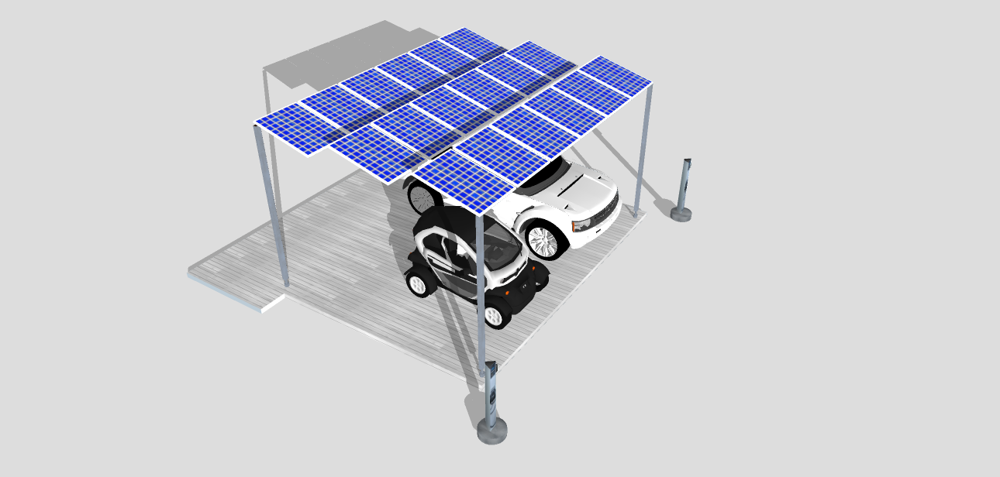

# skechup_designing

## In this repository I have stored few of my SketchUp drawings I designed.

### Best Poster Presentation Concept- Master's
 

### Ground-Mounted Bifacial PV System
 

### Ground-Mounted Monofacial PV System
 

### Rooftop PV System
 

### PV Carport System
 
